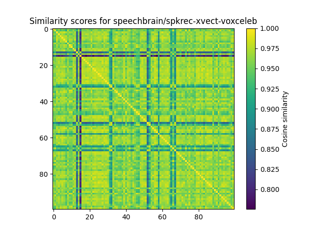
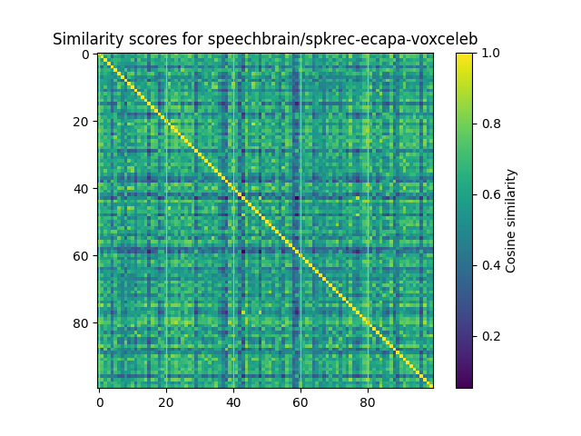
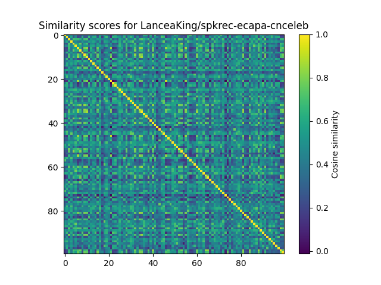
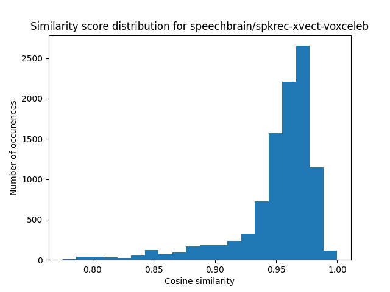
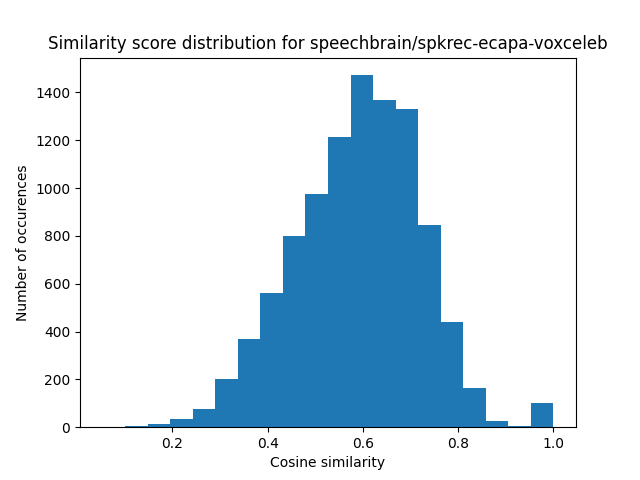
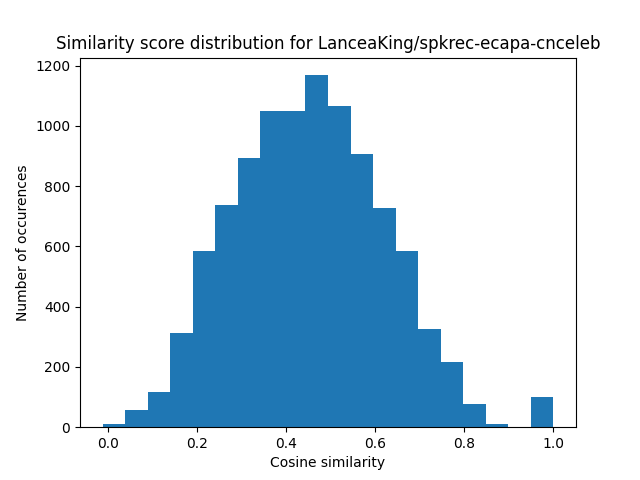
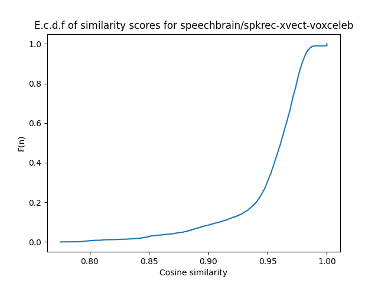
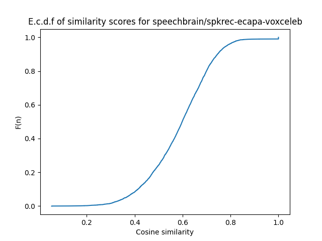
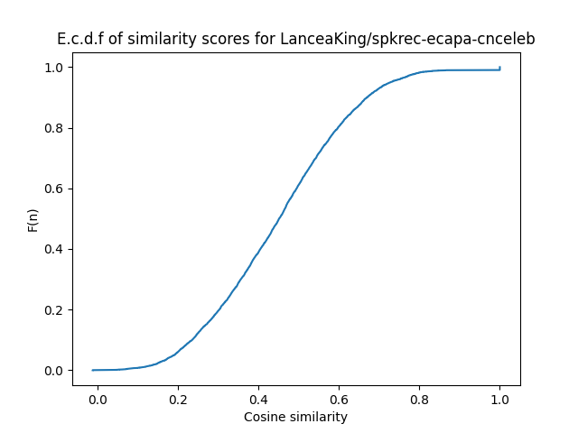

# Speaker Test
This repo presents a short test for evaluating the effectiveness of different
SpeechBrain models at differnetiating different speakers.

The dataset used is [Mozilla's Common Voice](https://commonvoice.mozilla.org/en) through kaggle. This dataset
holds thousands of short clips from different speakers.

The speaker embeddings are found using the selected model, and then their similarity scores are found using the 
cosine difference between the embeddings. The results are presented in a number of ways. Some of the models used are:
- [speechbrain/spkrec-xvect-voxceleb](https://huggingface.co/speechbrain/spkrec-xvect-voxceleb)
- [speechbrain/spkrec-ecapa-voxceleb](https://huggingface.co/speechbrain/spkrec-ecapa-voxceleb)
- [LanceaKing/spkrec-ecapa-cnceleb](https://huggingface.co/LanceaKing/spkrec-ecapa-cnceleb)
  - This one is trained on Chinese media, but produces interesing results

# Usage

To run the tests on your own, you can simply run:
```
poetry env use python3
poetry install
python3 main.py
```
Note that in order for torchaudio to load the audio files, a backend must be present on the system. The recomended software is ffmpeg version 6. This can be installed on Ubuntu using
`sudo apt install ffmpeg` or on macOS using Hombrew `brew install ffmpeg@6 && brew link ffmpeg@6`.

# Results

The results for the three models are presented below. The random seed used to sample is 80085. Hehe.

## Similarity matrix
These figures show, on a large scale, how similar the clips of different speakers are.  




## Histogram of similarity scores
The histogram of the distribution scores demonstrates the rough distribution of the similarity scores across all speakers.  




## E.C.D.F of similarity scores
An E.C.D.F gives a good idea of the differnt quantiles for the distribution.  




## Quantiles
Some quantiles for the distribuiton of scores is computed. These are useful as threshholds for acceptance.

<table>
    <tr>
        <th> Model </th>
        <th> q(0.6) </th>
        <th> q(0.7) </th>
        <th> q(0.75) </th>
        <th> q(0.8) </th>
        <th> q(0.9) </th>
    </tr>
    <tr>
        <td> spkrec-ecapa-voxceleb </td>
        <td> 0.6304247379302979 </td>
        <td> 0.6656997799873352 </td>
        <td> 0.682094156742096 </td>
        <td> 0.6995031833648682 </td>
        <td> 0.7450991868972778 </td>
    </tr>
</table>


# Conclusions
For the use case I am using the models for, the `speechbrain/spkrec-ecapa-voxceleb` seems like a better
fit than `speechbrain/spkrec-xvect-voxceleb`, as it does not give high confidence scores when the speakers are distinct.

More testing should be done on how well the models identifies that the speaker is the same on different clips of the same speaker. However,
since the models were prepared and tested using the voxceleb dataset seperately, I trust that they both already excel in this regard.
